# 📊 Class Diagram - SwiftLearningApp

## Architecture Overview

```mermaid
classDiagram
    %% ViewModels
    class LearningViewModel {
        +[Topic] topics
        +LearningProgress userProgress
        +Bool isLoading
        +String? errorMessage
        +loadTopics() async
        +startTopic(Topic)
        +completeQuiz(score: Double, topicId: String)
        +getTopicProgress(topicId: String) TopicProgress?
    }
    
    class QuizViewModel {
        +[Question] questions
        +Int currentQuestionIndex
        +[String:String] userAnswers
        +Bool showResults
        +Double score
        +Question? currentQuestion
        +Double progress
        +Bool isLastQuestion
        +loadQuestions(topicId: String) async
        +submitAnswer(questionId: String, answer: String)
        +nextQuestion()
        +previousQuestion()
        +calculateScore() Double
        +finishQuiz()
    }
    
    class CodeExampleViewModel {
        +[CodeExample] codeExamples
        +CodeExample? currentExample
        +Bool showBeforeCode
        +loadExamples(topicId: String) async
        +selectExample(CodeExample)
        +getDisplayCode(example: CodeExample) String
    }
    
    %% Services
    class ContentService {
        +static shared
        +loadTopics() async throws [Topic]
        +loadQuestions(topicId: String) async throws [Question]
        +loadCodeExamples(topicId: String) async throws [CodeExample]
    }
    
    class ProgressService {
        +static shared
        +loadProgress() LearningProgress
        +saveProgress(LearningProgress)
    }
    
    class WebQuestionService {
        +static shared
        +fetchToughQuestions() async throws [WebQuestion]
        +getCachedQuestions() [WebQuestion]
        +static loadCachedQuestionsFromDisk() [WebQuestion]
    }
    
    class WebQuestionData {
        +static getCuratedQuestions() [WebQuestion]
    }
    
    %% Models
    class Topic {
        +String id
        +String title
        +String description
        +[TopicSection] sections
        +Double progress
        +Bool isCompleted
    }
    
    class TopicSection {
        +String id
        +String title
        +String content
        +[String] codeExampleIds
    }
    
    class Question {
        +String id
        +String question
        +QuestionType type
        +[String]? options
        +String correctAnswer
        +String explanation
        +String? codeSnippet
    }
    
    class CodeExample {
        +String id
        +String title
        +String description
        +String code
        +String? beforeCode
        +String? afterCode
        +Bool isMigrationExample
        +[CodeAnnotation] annotations
    }
    
    class WebQuestion {
        +String id
        +String title
        +String question
        +String source
        +String sourceType
        +Difficulty difficulty
        +[String] tags
        +String? solution
        +String? codeSnippet
        +Int? upvotes
    }
    
    class LearningProgress {
        +Int totalTopicsCompleted
        +Double totalTimeSpent
        +[String:TopicProgress] topicProgress
        +[String] achievements
        +updateProgress(topicId: String, progress: Double, isCompleted: Bool)
        +addQuizScore(topicId: String, score: Double)
    }
    
    class TopicProgress {
        +Double progress
        +Bool isCompleted
        +[Double] quizScores
    }
    
    %% Views
    class ContentView {
        +Int selectedTab
        +body: some View
    }
    
    class TopicListView {
        +NavigationPath navigationPath
        +Bool isPaginatedLayout
        +Int currentPageIndex
        +body: some View
    }
    
    class TopicDetailView {
        +Topic topic
        +CodeExampleViewModel codeExampleViewModel
        +Bool showQuiz
        +CodeExample? selectedExample
        +body: some View
    }
    
    class QuizView {
        +String topicId
        +QuizViewModel quizViewModel
        +body: some View
    }
    
    class ProgressView {
        +body: some View
    }
    
    class WebQuestionsView {
        +[WebQuestion] questions
        +Bool isLoading
        +WebQuestion? selectedQuestion
        +body: some View
    }
    
    %% Components
    class TopicCardView {
        +Topic topic
        +() -> Void action
        +body: some View
    }
    
    class PaginatedTopicCardView {
        +Topic topic
        +() -> Void action
        +body: some View
    }
    
    class QuestionView {
        +Question question
        +QuizViewModel quizViewModel
        +body: some View
    }
    
    class QuizResultsView {
        +QuizViewModel quizViewModel
        +String topicId
        +body: some View
    }
    
    %% Utilities
    class AppColorTheme {
        +static Color exoticPurple
        +static Color exoticCyan
        +static Color primaryText
        +static Color secondaryText
        +static func topicColor(topicId: String) Color
        +static func topicIcon(topicId: String) String
        +static var smoothGradientBackground: some View
    }
    
    %% Relationships
    LearningViewModel --> ContentService : uses
    LearningViewModel --> ProgressService : uses
    LearningViewModel --> Topic : manages
    LearningViewModel --> LearningProgress : manages
    
    QuizViewModel --> ContentService : uses
    QuizViewModel --> Question : manages
    
    CodeExampleViewModel --> ContentService : uses
    CodeExampleViewModel --> CodeExample : manages
    
    WebQuestionService --> WebQuestionData : uses
    WebQuestionService --> WebQuestion : manages
    
    ContentView --> TopicListView : contains
    ContentView --> ProgressView : contains
    ContentView --> WebQuestionsView : contains
    
    TopicListView --> TopicCardView : uses
    TopicListView --> PaginatedTopicCardView : uses
    TopicListView --> LearningViewModel : observes
    
    TopicDetailView --> TopicSectionView : uses
    TopicDetailView --> CodeExampleCardView : uses
    TopicDetailView --> QuizView : presents
    TopicDetailView --> CodeExampleView : presents
    TopicDetailView --> LearningViewModel : observes
    TopicDetailView --> CodeExampleViewModel : uses
    
    QuizView --> QuestionView : uses
    QuizView --> QuizResultsView : uses
    QuizView --> QuizViewModel : uses
    QuizView --> LearningViewModel : observes
    
    QuestionView --> AnswerOptionView : uses
    QuestionView --> CodeBlockView : uses
    
    ProgressView --> StatCardView : uses
    ProgressView --> TopicProgressCardView : uses
    ProgressView --> AchievementCardView : uses
    ProgressView --> LearningViewModel : observes
    
    WebQuestionsView --> WebQuestionCardView : uses
    WebQuestionsView --> WebQuestionDetailView : presents
    WebQuestionsView --> WebQuestionService : uses
    
    Topic --> TopicSection : contains
    Topic --> CodeExample : references
    
    LearningProgress --> TopicProgress : contains
```



## Key Design Patterns

### 1. MVVM Architecture
- **Models**: Topic, Question, CodeExample, WebQuestion, LearningProgress
- **Views**: SwiftUI views that observe ViewModels
- **ViewModels**: Observable classes that manage state and business logic

### 2. Service Layer Pattern
- **ContentService**: Handles loading topics, questions, and code examples
- **ProgressService**: Manages user progress persistence
- **WebQuestionService**: Fetches and caches web questions

### 3. Component-Based UI
- Reusable view components in `Views/Components/`
- Modular design with single responsibility
- View modifiers for consistent styling

### 4. Observable Pattern
- Uses Swift 6 `@Observable` macro
- Automatic view updates on state changes
- MainActor isolation for UI updates

## Data Flow

```
User Action → View → ViewModel → Service → Model
                ↓
            State Update
                ↓
            View Re-renders
```
