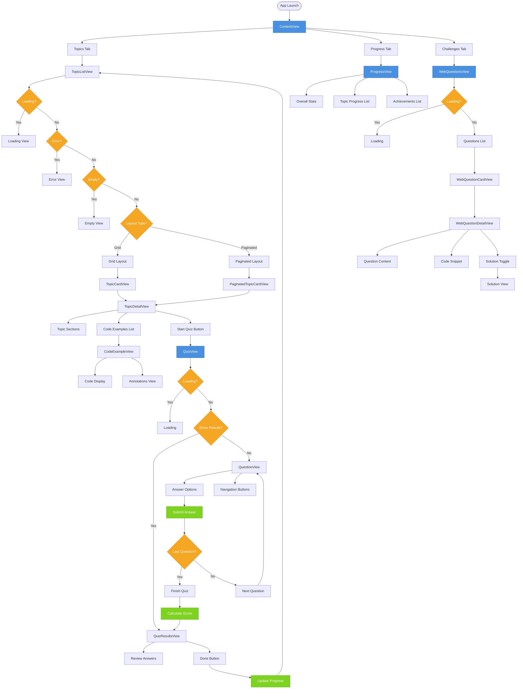
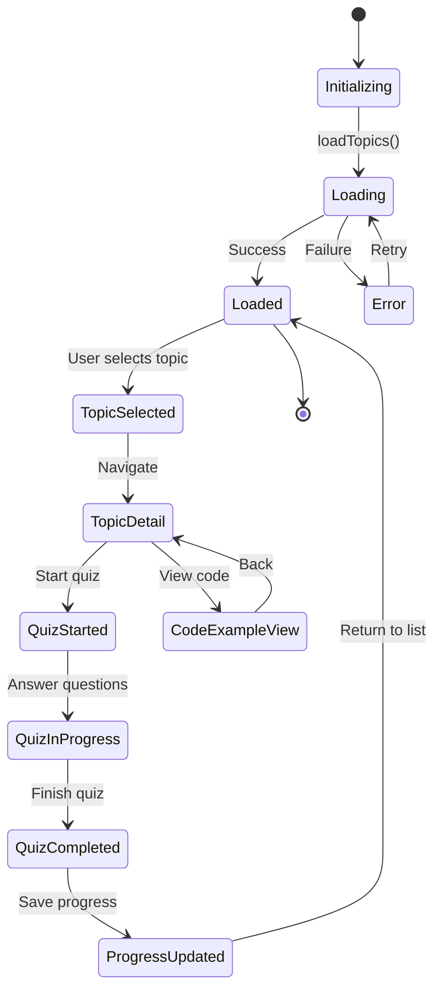
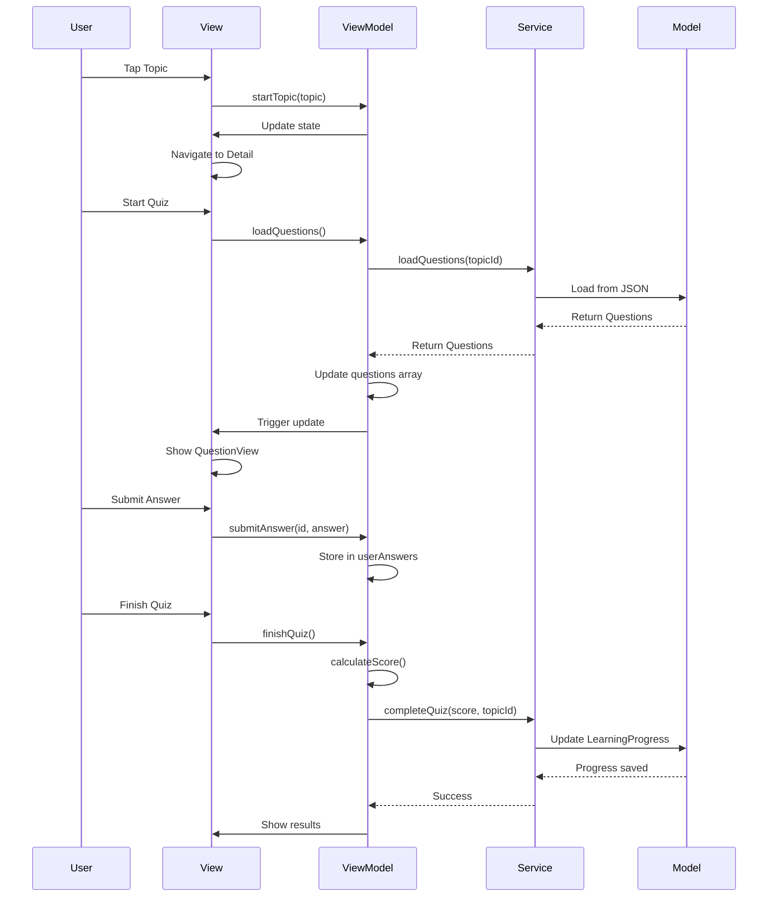

# 🔄 Flow Diagram - SwiftLearningApp

## Application Flow



## User Journey Flow

### 1. App Launch → Topics List
```
App Launch
  ↓
ContentView (TabView)
  ↓
Topics Tab (Default)
  ↓
TopicListView
  ↓
Load Topics (async)
  ↓
Display Grid/Paginated Layout
```

### 2. Topic Selection → Detail View
```
User Taps Topic Card
  ↓
TopicDetailView
  ↓
Load Code Examples (async)
  ↓
Display Sections + Code Examples
```

### 3. Quiz Flow
```
User Taps "Start Quiz"
  ↓
QuizView
  ↓
Load Questions (async)
  ↓
QuestionView (First Question)
  ↓
User Selects Answer
  ↓
Submit Answer → Store
  ↓
Next Question (or Finish)
  ↓
Calculate Score
  ↓
QuizResultsView
  ↓
Update Progress
  ↓
Return to Topics
```

### 4. Progress Tracking
```
User Switches to Progress Tab
  ↓
ProgressView
  ↓
Load User Progress
  ↓
Display Stats + Topic Progress + Achievements
```

### 5. Challenges Flow
```
User Switches to Challenges Tab
  ↓
WebQuestionsView
  ↓
Fetch Tough Questions (async)
  ↓
Display Question Cards
  ↓
User Taps Question
  ↓
WebQuestionDetailView
  ↓
Show Question + Solution Toggle
```

## State Management Flow



## Data Flow Architecture


